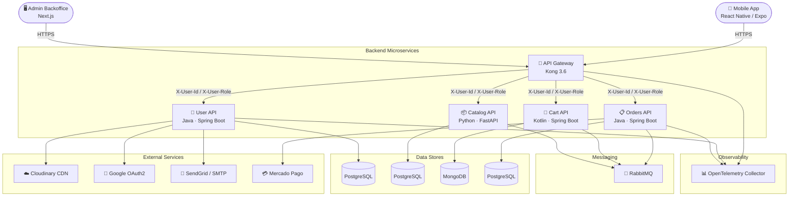

# Bazaar

[](https://github.com/Baza-ar)
[](https://www.docker.com/)
[](LICENSE)

**Bazaar** is a full-stack marketplace platform built on a microservices architecture. It enables users to buy and sell products through a mobile application, while administrators manage the ecosystem via a dedicated backoffice panel. The platform handles the complete e-commerce lifecycle — from product listing and discovery, through shopping cart management and secure checkout with Mercado Pago integration, to order tracking, delivery status updates, and review systems.

---

## Table of Contents

1. [Platform Architecture](#platform-architecture)
2. [Repository Map](#repository-map)
3. [Technology Stack](#technology-stack)
4. [Getting Started](#getting-started)
5. [Infrastructure & Networking](#infrastructure--networking)
6. [Observability](#observability)
7. [Testing](#testing)
8. [Contributing](#contributing)
9. [License](#license)

---

## Platform Architecture

All client traffic flows through a centralized **API Gateway** (Kong), which handles JWT authentication, CORS, identity header injection, and distributed tracing before routing requests to the appropriate downstream microservice.



> [!NOTE]
> Backend microservices rely on **trust-based authorization**. The API Gateway validates JWTs and injects `X-User-Id` and `X-User-Role` headers, freeing downstream services from token parsing logic.

---

## Repository Map

The organization is structured into **8 repositories**, each with a clear boundary of responsibility:

### 🔀 API Gateway — [`api-gateway`](https://github.com/Baza-ar/api-gateway)

Reverse proxy and API Gateway built on **Kong 3.6** (db-less/declarative mode). Single entry point for all client requests.

| Capability | Details |
|---|---|
| JWT Validation | HMAC-SHA256 token verification with expiration & issuer enforcement |
| Identity Injection | Lua post-functions extract & forward `X-User-Id` and `X-User-Role` |
| Login Source Tracking | Pre-function inspects `Origin` to tag Backoffice vs. mobile requests |
| CORS | Global cross-origin policy for all routes |
| Telemetry | OpenTelemetry integration for distributed tracing |
| Health Checks | `/livez` and `/health` endpoints |

---

### 👤 User API — [`api-user`](https://github.com/Baza-ar/api-user)

Identity, authentication, and user profile management microservice.

| Capability | Details |
|---|---|
| Authentication | Email/Password (BCrypt) + Google SSO (Federated Identity) |
| Token Management | JWT access/refresh cycle with session rotation |
| Profile Management | Name, surname, description, multi-part image upload via Cloudinary |
| Admin Controls | Paginated user registry, account lock/unlock, registration metrics |
| Deep Linking | Android Digital Asset Links (`.well-known/assetlinks.json`) |
| **Tech** | **Java 21 · Spring Boot 4.0.3 · PostgreSQL 15 · Flyway · Caffeine Cache** |

---

### 📦 Catalog API — [`api-catalog`](https://github.com/Baza-ar/Catalog)

Product catalog management — listing, searching, filtering, and media upload.

| Capability | Details |
|---|---|
| Product CRUD | Create, update, delete, and query products |
| Image Storage | Cloudinary integration for product images |
| Search & Filtering | Category-based filtering and full-text search |
| Inter-Service Comm. | Communicates with User and Orders APIs; RabbitMQ messaging |
| **Tech** | **Python 3.11 · FastAPI · SQLAlchemy · Alembic · PostgreSQL · RabbitMQ** |

---

### 🛒 Cart API — [`api-cart`](https://github.com/Baza-ar/api-cart)

Shopping cart lifecycle management — item additions, quantity updates, and cart persistence.

| Capability | Details |
|---|---|
| Cart Operations | Add, remove, update quantities, clear cart |
| Persistence | MongoDB-backed cart storage |
| Event Publishing | RabbitMQ integration for cart-related events |
| **Tech** | **Kotlin · Spring Boot 4.0.5 · MongoDB · Mongock Migrations · RabbitMQ** |

---

### 📋 Orders API — [`api-orders`](https://github.com/Baza-ar/api-orders)

Checkout orchestration, payment processing, order lifecycle tracking, and review system.

| Capability | Details |
|---|---|
| Checkout | Multi-seller order splitting with unified Mercado Pago payment |
| Order Lifecycle | State machine (pending → paid → shipped → delivered → cancelled) |
| Reviews | Buyer ratings for sellers (order-level) and products (item-level) |
| Analytics | Admin dashboard metrics: transaction volume, daily stats, category breakdown |
| Background Jobs | `OrderPaymentCleanupScheduler` — purges expired/rejected payments and restores stock |
| **Tech** | **Java 21 · Spring Boot 4.0.6 · PostgreSQL 15 · Flyway · RabbitMQ · Mercado Pago SDK** |

---

### 🖥️ Admin Backoffice — [`admin-backoffice`](https://github.com/Baza-ar/admin-backoffice)

Web-based administration panel for platform operators.

| Capability | Details |
|---|---|
| Session Management | Secure login with access/refresh token handling |
| User Administration | Search, filter, block/unblock user accounts |
| Dashboard | Analytics and platform health overview |
| Theming | Light and dark mode support |
| **Tech** | **Next.js 15 (App Router) · TypeScript · Tailwind CSS · Shadcn/ui · Recharts** |

---

### 📱 Mobile App — [`app-mobile`](https://github.com/Baza-ar/app-mobile)

Cross-platform mobile marketplace application for buyers and sellers.

| Capability | Details |
|---|---|
| Authentication | Email/password registration + Google SSO |
| Product Discovery | Home feed, search with filters (category, price, condition), sorting |
| Product Publishing | Multi-image upload with camera/gallery integration |
| Shopping | Cart management, checkout flow |
| Profile | User profile viewing and editing |
| **Tech** | **React Native · Expo 54 · Expo Router · NativeWind (Tailwind) · TypeScript** |

---

### 📚 Technical Docs — [`technical-docs`](https://github.com/Baza-ar/technical-docs)

Centralized cross-cutting documentation hub.

| Content | Details |
|---|---|
| ADRs | Architecture Decision Records for historical technical choices |
| Performance Testing | k6 load test reports and benchmarks |
| User Manuals | System operation guides and API consumption instructions |

---

## Technology Stack

| Layer | Technologies |
|---|---|
| **Mobile** | React Native, Expo 54, Expo Router, NativeWind, TypeScript |
| **Backoffice** | Next.js 15, TypeScript, Tailwind CSS, Shadcn/ui, Recharts |
| **API Gateway** | Kong 3.6 (db-less), Lua scripting, OpenTelemetry |
| **Backend (Java)** | Java 21, Spring Boot 4.x, Spring Security, Spring Data JPA, Flyway |
| **Backend (Kotlin)** | Kotlin, Spring Boot 4.x, Spring Data MongoDB, Mongock |
| **Backend (Python)** | Python 3.11, FastAPI, SQLAlchemy, Alembic |
| **Databases** | PostgreSQL 15, MongoDB |
| **Messaging** | RabbitMQ (AMQP) |
| **Payments** | Mercado Pago SDK |
| **Media Storage** | Cloudinary |
| **Auth** | JWT (HMAC-SHA256), Google OAuth2 SSO |
| **Email** | SendGrid, SMTP Relay |
| **Observability** | OpenTelemetry, Spring Boot Actuator, Micrometer |
| **Containerization** | Docker, Docker Compose |
| **Performance Testing** | k6 (Grafana) |

---

## Getting Started

### Prerequisites

- [Docker](https://www.docker.com/) & [Docker Compose](https://docs.docker.com/compose/)
- [Java 21 (JDK)](https://openjdk.org/) — for User, Cart, and Orders APIs
- [Python 3.11+](https://www.python.org/) — for Catalog API
- [Node.js](https://nodejs.org/) — for Mobile App and Admin Backoffice

### 1. Create the Shared Docker Network

All microservices communicate over a shared Docker network:

```bash
docker network create bazaar-network
```

### 2. Clone the Repositories

```bash
# Clone all repositories into a workspace directory
git clone https://github.com/Baza-ar/api-gateway.git
git clone https://github.com/Baza-ar/api-user.git
git clone https://github.com/Baza-ar/Catalog.git api-catalog
git clone https://github.com/Baza-ar/api-cart.git
git clone https://github.com/Baza-ar/api-orders.git
git clone https://github.com/Baza-ar/admin-backoffice.git
git clone https://github.com/Baza-ar/app-mobile.git
git clone https://github.com/Baza-ar/technical-docs.git
```

### 3. Configure Environment Variables

Each service requires a `.env` file. Copy the example templates:

```bash
cp api-gateway/.env.example   api-gateway/.env
cp api-user/.env.example       api-user/.env
cp api-catalog/.env.example    api-catalog/.env
cp api-cart/.env.example       api-cart/.env
cp api-orders/.env.example     api-orders/.env
```

> [!IMPORTANT]
> Ensure JWT secrets (`JWT_SECRET`, `JWT_ISSUER`) are consistent across the **API Gateway** and the **User API** to maintain authentication integrity.

### 4. Start the Platform

Launch the services in the recommended order:

```bash
# 1. Start the API Gateway
cd api-gateway && docker-compose up --build -d && cd ..

# 2. Start the User API
cd api-user && docker-compose up --build -d && cd ..

# 3. Start the Catalog API
cd api-catalog && docker-compose up -d && cd ..

# 4. Start the Cart API
cd api-cart && docker-compose up --build -d && cd ..

# 5. Start the Orders API
cd api-orders && docker-compose up --build -d && cd ..

# 6. Start the Admin Backoffice (development)
cd admin-backoffice && npm install && npm run dev &
cd ..

# 7. Start the Mobile App (development)
cd app-mobile && npm install && npx expo start --clear &
```

### 5. Verify Health

```bash
curl http://localhost:8000/health
# Expected: {"status": "UP", "gateway": "Kong"}
```

---

## Infrastructure & Networking

All services run in Docker containers connected via the `bazaar-network` bridge network. Each service has its own `docker-compose.yml` defining its container, database, and dependency setup.

| Service | Default Port | Database |
|---|---|---|
| API Gateway | `8000` (HTTP) / `8443` (HTTPS) | — (db-less) |
| User API | `8080` | PostgreSQL 15 |
| Catalog API | Configurable via `PORT` env | PostgreSQL 14 |
| Cart API | Configurable via `PORT` env | MongoDB |
| Orders API | `8080` | PostgreSQL 15 |
| Admin Backoffice | `3000` (dev server) | — (API consumer) |
| Mobile App | Expo Dev Server | — (API consumer) |

---

## Observability

The platform integrates **OpenTelemetry** for distributed tracing across the gateway and backend services:

- **API Gateway**: Exports request-level traces via the Kong OpenTelemetry plugin.
- **User API & Orders API**: Instrumented with the OpenTelemetry Java Agent for automatic span collection.
- **Spring Boot Actuator**: Exposes `/actuator/health`, `/livez`, and `/readyz` endpoints for liveness and readiness probes.
- **Metrics**: Micrometer integration ready for Prometheus/Grafana dashboards.

---

## Testing

### Unit & Integration Tests

| Service | Command | Framework |
|---|---|---|
| User API | `./mvnw clean test` | JUnit 5, Testcontainers |
| Cart API | `./mvnw clean test` | JUnit 5, MockK, Testcontainers |
| Orders API | `./mvnw clean test` | JUnit 5, Testcontainers |
| Catalog API | `./run_tests.sh` or `docker compose -f docker-compose.test.yml up` | Pytest |

### Performance & Stress Testing (k6)

Load tests are available in the `api-gateway/test/k6/scripts/` directory and can be executed via Dockerized k6:

```bash
docker run --rm --network bazaar-network \
  -v "$(pwd)/test/k6:/io" -w /io \
  grafana/k6 run scripts/<test_name>.js
```

Available scripts: `login-stress.js`, `register-stress.js`, `create-product-stress.js`, `checkout-stress.js`

> [!TIP]
> Detailed performance reports and benchmarks are maintained in the [`technical-docs`](https://github.com/Baza-ar/technical-docs) repository.

---

## Contributing

1. **Branch naming**: Use `feature/<description>` or `fix/<description>`.
2. **Pull Requests**: All changes require a PR with peer review before merging into `main`.
3. **Documentation**: Update the relevant repository README and the [`technical-docs`](https://github.com/Baza-ar/technical-docs) repo for cross-cutting changes.
4. **Code Quality**: Run linters and formatters before committing. Each repo has its own ESLint/Prettier or equivalent configuration.

---

## License

This project is licensed under the **MIT License**. See the [LICENSE](LICENSE) files in each repository for details.

---

<p align="center">
  <strong>Bazaar</strong> — Built with ❤️ by the <a href="https://github.com/Baza-ar">Baza-ar</a> Team &copy; 2026
</p>